# TechShop User Flows — Navigation Blueprint

**Status:** Source of truth for navigation & journeys · **Version:** 1.0 · **Last updated:** 2026-08-07
**Reads with:** [`design-system.md`](./design-system.md) · [`pages/`](./pages/) · [`components/`](./components/) · [`auth/`](./auth/) · [`admin/`](./admin/)

This document maps **how users move through TechShop** — every route, transition, gate, and terminal state. It's the blueprint that ties the page specs together: where each screen sits, what it leads to, and what guards the edges. Each flow gets a short explanation and, where it clarifies, a Mermaid diagram. Documentation only — no code.

**Guiding principles that shape every flow** (from the design system & page specs):
- **Browse-first** — guests can browse, search, add to cart, and save without an account; sign-in is the reward (personalization, persistence), not a wall.
- **State lives in the URL** for shareable views (catalog/search/filters); it does **not** for transient/sensitive processes (checkout, auth).
- **Reversible > confirm** (optimistic + Undo); **irreversible = deliberate** (typed confirmation). **Silent success** for visible changes.
- **Never a dead end** — every empty/error/zero state offers a next action.

### Diagram legend

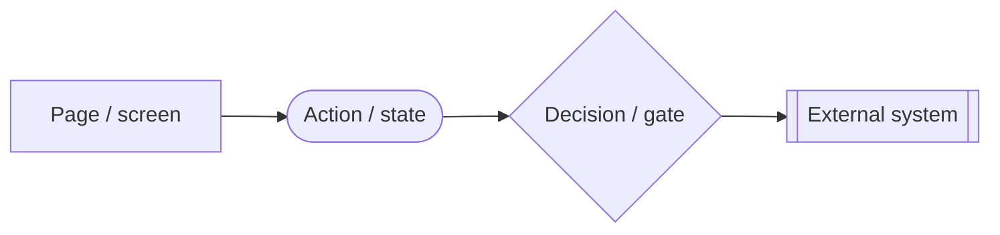

- **Rectangle** = a page/screen · **rounded** = an action or transient state · **diamond** = a decision/gate · **double-box** = an external system (e.g., VNPay, Google OAuth).
- `⌦ gated` marks a flow that depends on a **backend module not yet built** (orders, wishlist, password-reset, settings) — designed and ready, guarded until the API lands.

---

## Route map (the blueprint)

| Route | Screen (spec) | Access | Backend today |
|---|---|---|---|
| `/` | [Home](./pages/home.md) | Public | Live |
| `/catalog` · `?category=` · `?q=`→ | [Catalog](./pages/catalog.md) | Public | Products live |
| `/search?q=` | [Search](./pages/search.md) | Public | Search reuses catalog engine |
| `/product/:slug` | [Product detail](./pages/product-detail.md) | Public | Live |
| `/cart` | [Cart](./pages/cart.md) | Public (guest cart) | Cart client-side; merge on sign-in |
| `/checkout` · `/checkout/success` · `/checkout/failed` | [Checkout](./pages/checkout.md) | Sign-in gate* | Order create + VNPay ⌦ gated |
| `/orders/:id` | Order detail | Signed-in | ⌦ gated (orders module) |
| `/wishlist` | [Wishlist](./pages/wishlist.md) | Signed-in / guest-local | ⌦ gated (wishlist module) |
| `/profile` · `/profile/{orders,addresses,notifications,security}` | [Profile](./pages/profile.md) | Signed-in | Profile live; some tabs gated |
| `/auth` (login \| register modes) | [Login](./auth/login.md) · [Register](./auth/register.md) | Public | Live |
| `/auth/forgot-password` | [Forgot password](./auth/forgot-password.md) | Public | ⌦ gated (reset endpoint) |
| `/auth/verify-email` · `?token=` | [Verify email](./auth/verify-email.md) | Public | Verify live; resend ⌦ gated |
| `/auth/reset-password?token=` | [Reset password](./auth/reset-password.md) | Public | ⌦ gated |
| `/admin` | [Admin dashboard](./admin/dashboard.md) | ADMIN | Live |
| `/admin/products` · `categories` · `brands` · `customers` | [Products](./admin/products.md) et al. | ADMIN | Live CRUD |
| `/admin/orders` · `inventory` · `analytics` · `settings` | [Orders](./admin/orders.md) et al. | ADMIN | ⌦ gated / derived |

\* Checkout requires sign-in only if the backend keeps orders user-scoped; guest checkout is the target (see Checkout Flow).

### Master site map

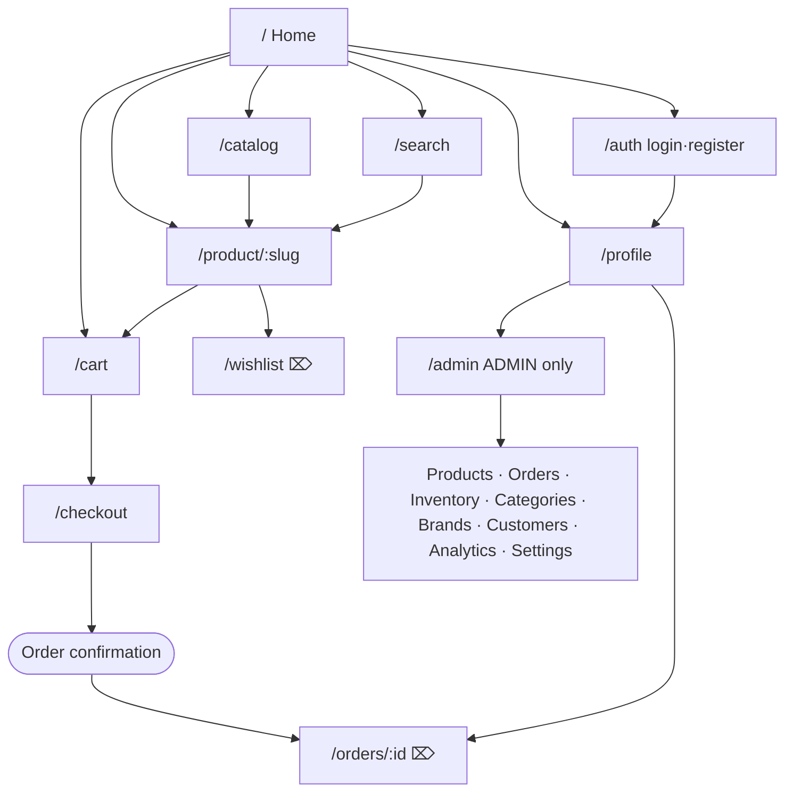

---

## Guest Flow

A guest (not signed in) is a first-class shopper. They can browse the catalog, search, open products, build a cart, and save to a local wishlist. Sign-in is nudged (for persistence/personalization) but never required to explore — the account gate appears only at the moments it must (checkout, viewing personal history). A guest cart/wishlist **merges into the account on sign-in**, so nothing they built is lost.

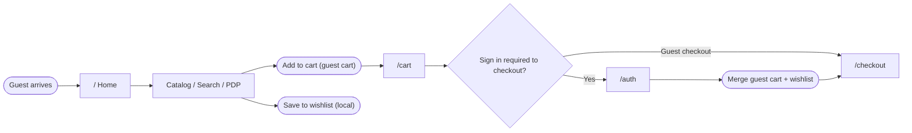

---

## Authentication Flow

Auth is one shell with **login** and **register** modes, plus **forgot-password → reset-password** and **verify-email** side-flows. Key rule from the specs: **registration does not sign the user in** — it creates the account and sends a verification email; the user verifies, then signs in. Login returns the user to their intended destination via `next` (e.g., back to checkout). Google OAuth is a full-page redirect. Errors are specific and non-enumerating.

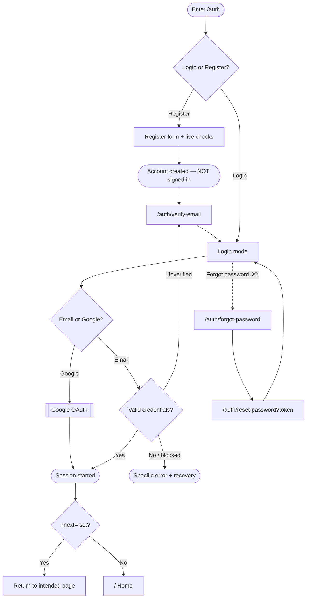

**Account states** (moderation) affect sign-in:

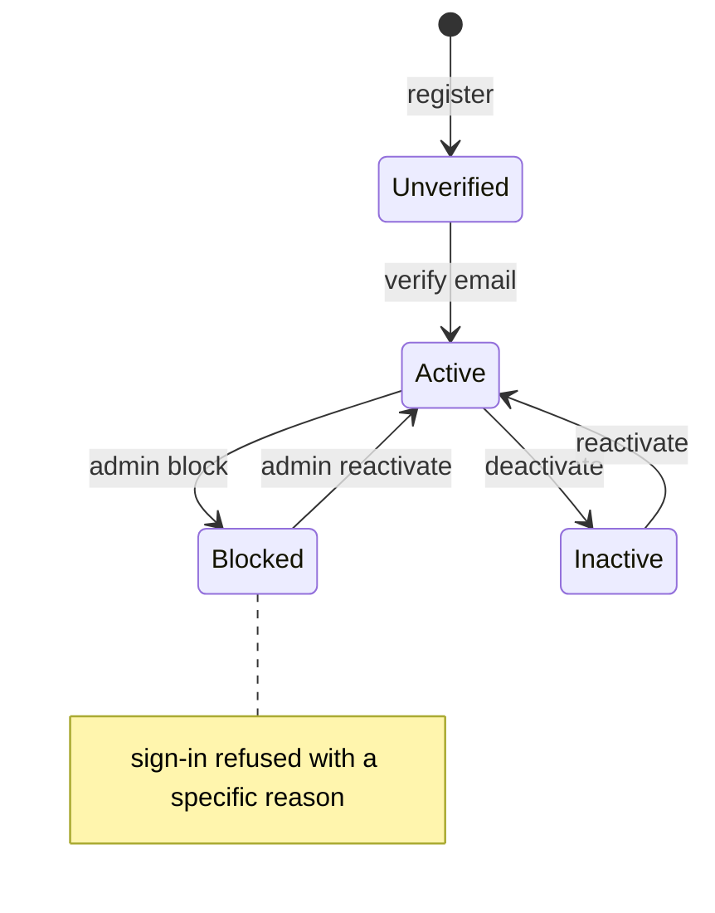

---

## Customer Flow

The end-to-end journey of a signed-in shopper: discover → evaluate → cart → checkout → track. Personalization (recommendations, saved cart/wishlist, order history) is the payoff for being signed in. This is the spine the storefront specs implement.

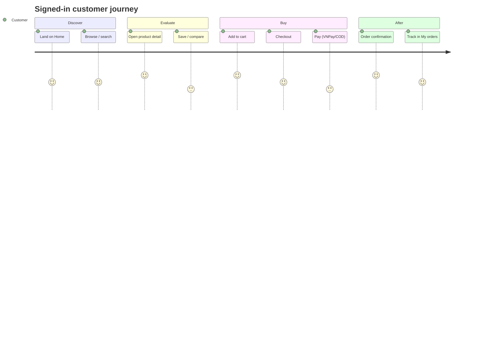

---

## Product Discovery Flow

Discovery is undirected browsing: the home page curates (promo, categories, featured/recommended rails), and the catalog page provides department browsing. The homepage deliberately curates rather than filters; deep filtering lives on the catalog. Every product tile leads to the PDP; the PDP offers related products to keep discovery going.

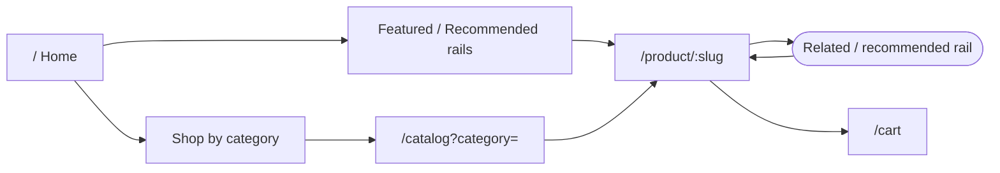

---

## Search & Filter Flow

Search and catalog share **one results engine**: the catalog owns *browse*, search owns *query*, and both reuse the same grid + facets + sort + pagination. Autocomplete can shortcut straight to a product (skipping the results page). Filters are composable, URL-encoded (shareable/back-safe), and never dead-end — zero-results offers spelling help, "did you mean", and popular products.

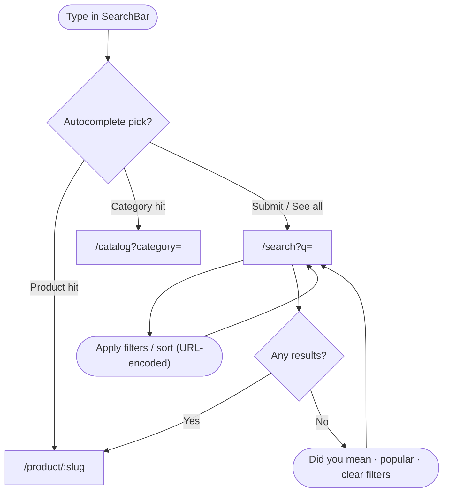

---

## Wishlist Flow ⌦

The wishlist is the "not now, but yes eventually" bucket. The **save (heart) toggle** lives on the ProductCard and PDP; `/wishlist` is the collection view. Guests save locally and the list **merges on sign-in** (or, if the backend can't merge in v1, saving prompts sign-in). From the collection, an item moves to the cart in one action; removals are optimistic + Undo. *(Gated on the wishlist backend module.)*

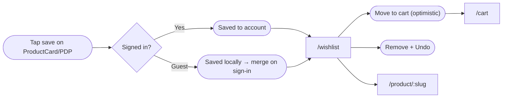

---

## Cart Flow

The cart is the review-and-adjust surface before checkout. Quantity edits are instant/optimistic; **removal is optimistic + Undo**, never an "are you sure?" dialog. Totals are honest — subtotal is real; shipping/tax show "calculated at checkout" until known. Stale items (price changed, low/out of stock, unavailable) are flagged and must be resolved before checkout. Proceeding routes to checkout (through the sign-in gate if required), carrying the cart.

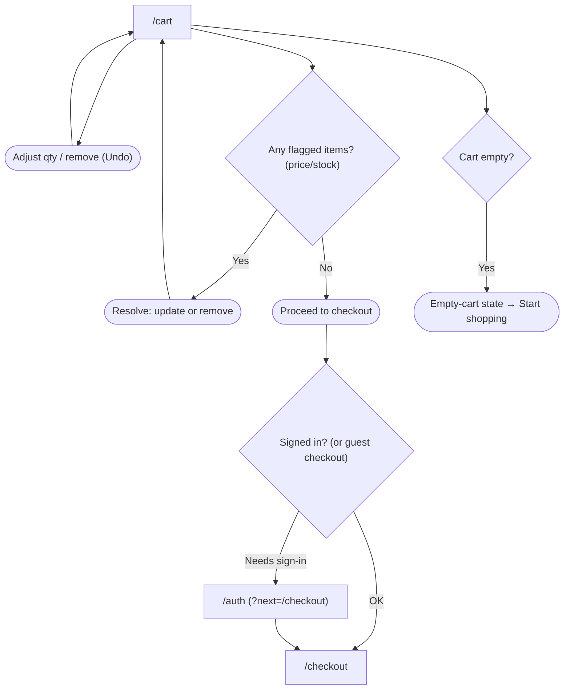

---

## Checkout Flow

Checkout is a **stepped, single-page flow** (Contact → Shipping → Delivery → Payment → Review) inside a **focused shell** (minimal header/footer to cut exits), with an always-visible order summary. Address precedes payment so the final total can be honest. **Payment is safe:** card/bank goes through **VNPay's hosted page** (redirect); COD is in-app — TechShop never collects card credentials. Placing the order locks the button (no double-submit) and re-validates the cart server-side before charging. *(Order creation + VNPay gated.)*

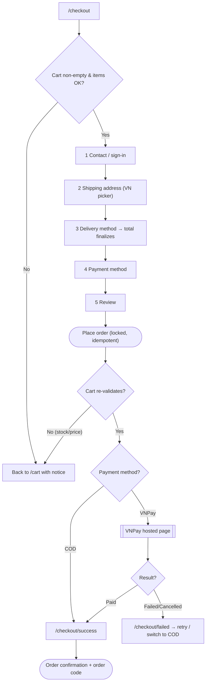

---

## Order Tracking Flow ⌦

After purchase, customers track orders from **Profile → My orders** (list with status filters + search) and open an **order detail** (`/orders/:id`) for the timeline, items, address, payment, and reorder. Admins process the other side in [`/admin/orders`](./admin/orders.md). Order status is a lifecycle both sides read. *(Customer order detail + admin orders are gated on the orders module.)*

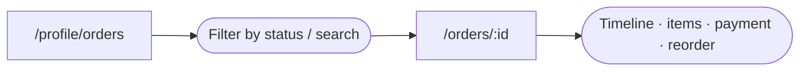

**Order lifecycle** (shared by customer & admin views):

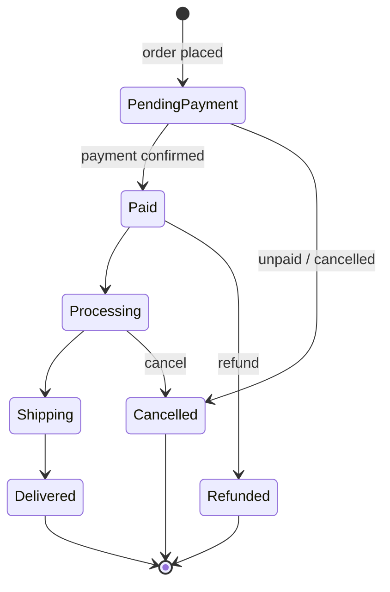

---

## Profile Flow

The account area is a tabbed hub (My account · Orders · Addresses · Notifications · Security), gated to signed-in users. A **session-restoring** state precedes the signed-out prompt so a returning user isn't wrongly shown "sign in." Address management reuses the checkout VN location picker; deleting an address is optimistic + Undo (default address is guarded).

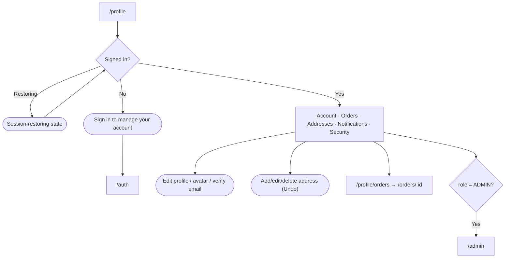

---

## Admin Flow

The admin console is **guarded by ADMIN role** with three distinct access states (restoring / not-signed-in / signed-in-non-admin) so a real admin is never wrongly rejected. The shell (sidebar + topbar) frames every section; the dashboard is the landing, and each section is a table/CRUD or a settings/analytics surface. Live sections (products, categories, brands, customers) and gated ones (orders, inventory, analytics, settings) share one shell and interaction language.

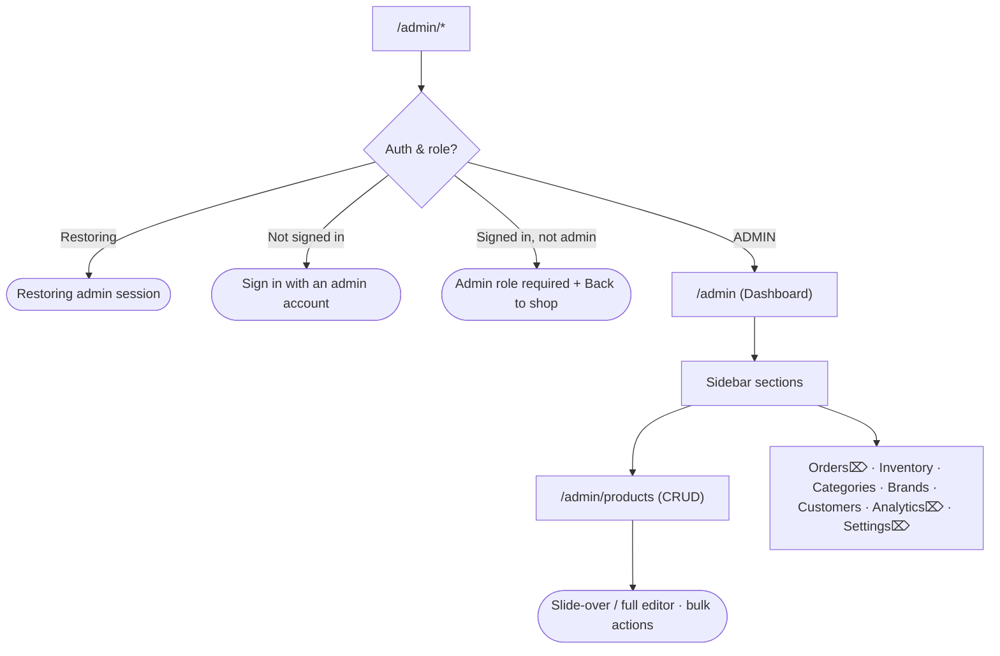

---

## Error Flows

Every failure is specific, recoverable, and keeps the app shell so the user can navigate away. Errors state *what happened and how to fix it*; irreversible/money operations are never left ambiguous.

| Error | Where | Behavior |
|---|---|---|
| **404 / not found** | Any route; removed/unpublished product | Not-found screen + "Browse catalog" (never a broken page) |
| **Auth required** | `/checkout`, `/profile`, `/orders/:id` | Redirect to `/auth?next=…`; return after sign-in |
| **Admin required** | `/admin/*` | "Admin role required" (or "sign in with admin") — not a crash |
| **Fetch failed** | Any data surface | Inline `role="alert"` + Retry; shell/sidebar stay |
| **Partial failure** | Dashboards, PDP, cart, admin | Per-widget/per-row error; the rest still renders |
| **Optimistic action failed** | Cart/wishlist/inline-edit | Revert exactly + inline error/Toast retry |
| **Payment failed / cancelled** | `/checkout/failed` | Explain; retry same order or switch to COD; order stays *pending* |
| **Invalid deep-link params** | catalog/search/reset/verify | Ignore/clamp bad values; render nearest valid view; rewrite URL |
| **Session expired mid-task** | Anywhere | Silent token refresh; hard failure → sign-in with `next` |
| **Double-submit / refresh after order** | Checkout | Idempotency key + button lock; refresh re-reads the existing order |

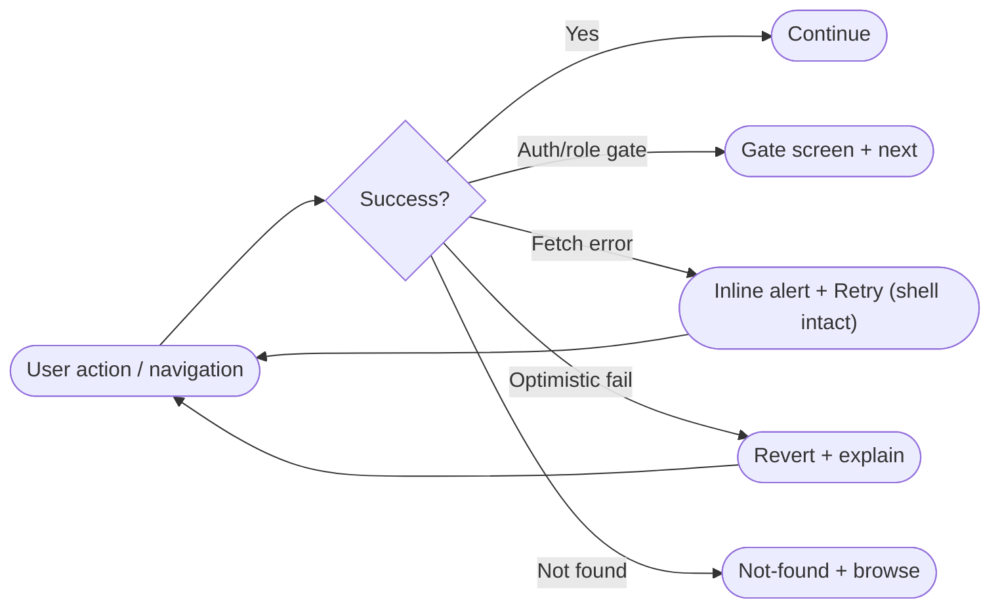

---

## Empty States

Empty is a designed destination, never a blank region — and the copy distinguishes *"nothing yet"* from *"nothing matches"* (different fixes). A section with genuinely nothing to show (e.g., no categories, no deals) is hidden rather than shown empty.

| Surface | Empty situation | Next action |
|---|---|---|
| Catalog / Search | No results (filtered) vs no query vs zero-match | Clear filters (keeps query) · did-you-mean · popular products |
| Cart | Never added vs removed-last vs all-unavailable | Start shopping (+ signed-in recommended rail) |
| Wishlist ⌦ | Empty vs signed-out vs all-unavailable | "Tap the heart…" teach · Sign in · Browse |
| Orders | No orders vs filtered-none | Start shopping vs clear filter |
| Addresses | None yet | Add address (VN picker) |
| Admin table | No data (new) vs no results (filtered) | Create vs clear filters |
| Admin dashboard | New store — real zeros / empty charts | Honest zero (never invented) |
| Admin planned module ⌦ | Orders/Inventory/Analytics/Settings not built | "Coming soon" placeholder (not a fake table) |

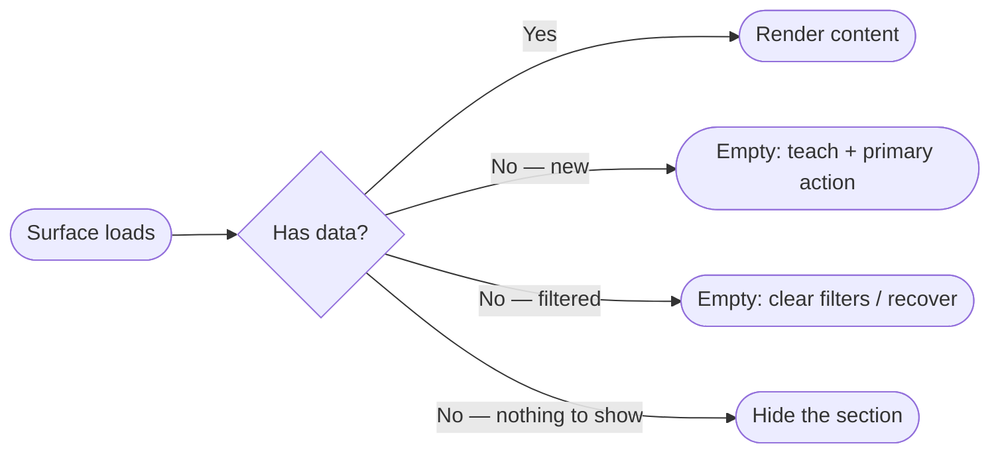

---

## Loading Flows

Skeletons over spinners wherever the layout is known; controls stay interactive during content loads; optimistic actions feel instant. Specific transitional states cover the high-stakes moments (session restore, payment redirect).

| Moment | Treatment |
|---|---|
| First page load | Shape-matched skeletons (cards/table/chart), delay-show ~150ms, hold ~300ms min |
| Session restore | Neutral "restoring" beat before form-vs-redirect (no flash of wrong state) |
| Filter / sort / search | Skeleton over the **results only**; toolbar/filters stay live |
| Optimistic edit | Instant change + quiet pending; exact revert on failure |
| Add to cart | Optimistic cart-badge bump + mini-cart (no celebratory toast) |
| "Load more" | Button loading → appended skeleton → focus moves to first new item |
| Checkout place-order | Button locks + "Placing your order…" (double-submit guard) |
| Payment redirect | Full-screen "Redirecting to VNPay…" then hosted page |
| Gateway return | "Confirming your payment…" → success/failed |

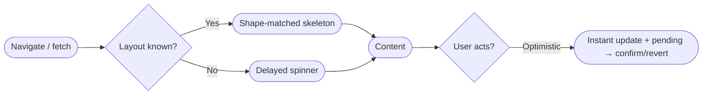

---

## Backend-gating summary

Flows marked ⌦ are fully designed and ready but depend on modules not yet built. Order of dependency:

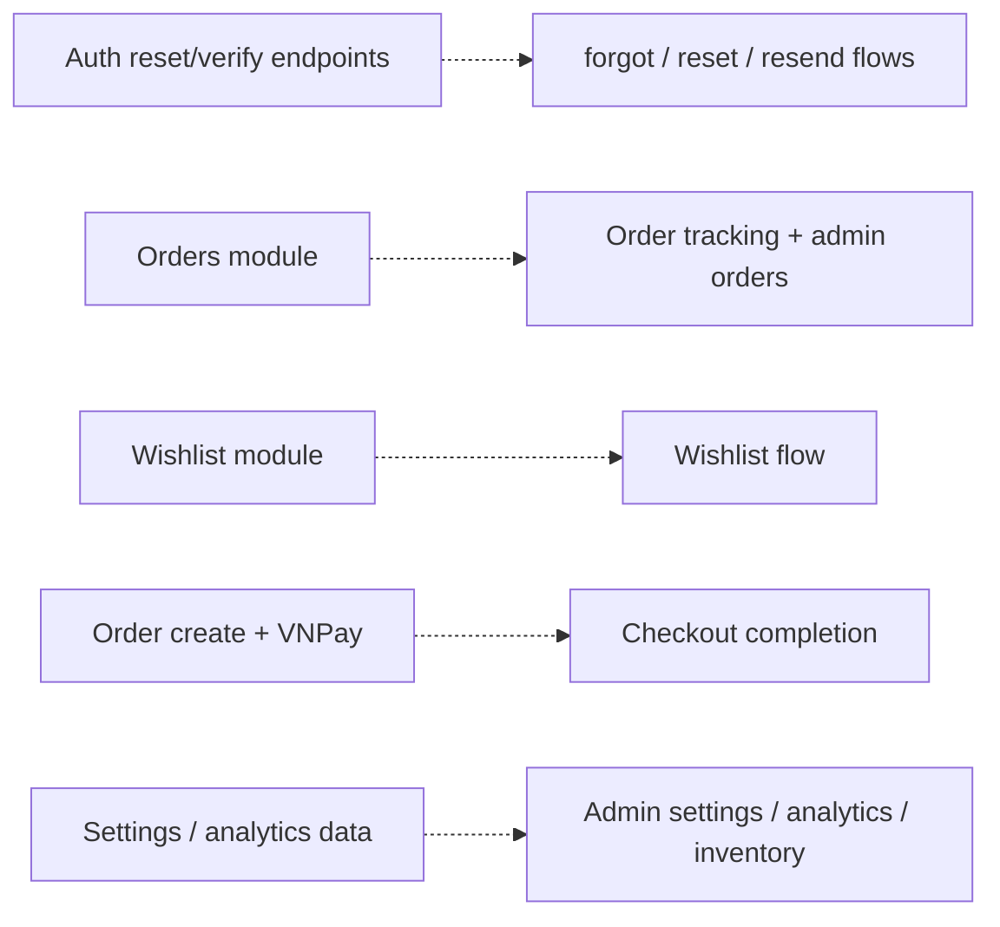

Until each lands: the entry points stay hidden or show a **"coming soon" placeholder** (never a dead link or a fake screen), and guest/gated variants degrade gracefully to what *is* built (e.g., checkout falls back to required sign-in; wishlist falls back to sign-in-to-save).

---

*This blueprint is authoritative for routing and navigation. New screens enter the route map here first, declare their access + backend status, and connect into the relevant flow. Individual screen behaviour lives in its page spec under [`pages/`](./pages/), [`auth/`](./auth/), or [`admin/`](./admin/); component behaviour in [`components/`](./components/).*
